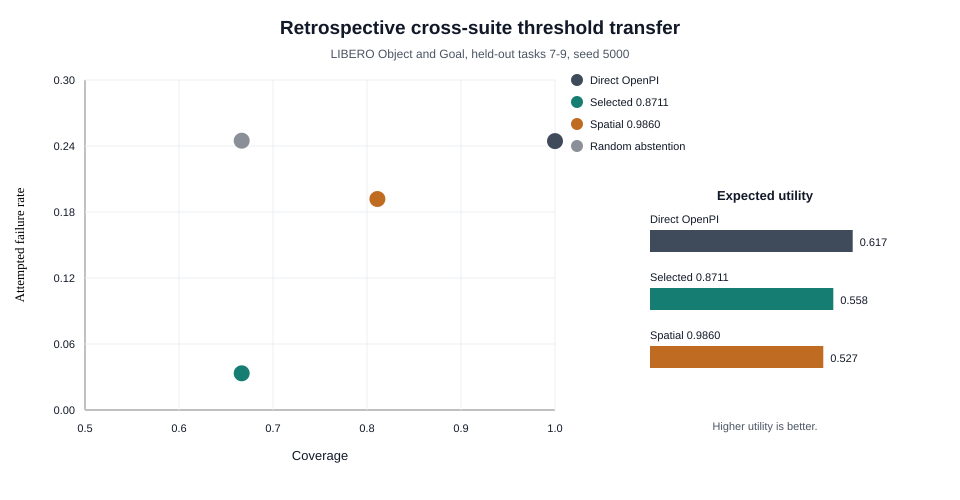

# Project Status

Date: 2026-09-22

## Research Question

Can an observed-state risk model improve OpenPI execution under distribution shift?

The current answer is qualified.

The SigLIP supervisor reduces failures among attempted episodes.

The supervisor does not give a robust utility gain across LIBERO suites.

## System

OpenPI supplies the `pi05_libero` robot policy.

LIBERO supplies the manipulation tasks and initial states.

Robosuite and MuJoCo supply simulation and rendering.

The supervisor uses a frozen SigLIP image embedding.

It also uses 10 steps of observable progress data.

A logistic model predicts episode failure risk.

The supervisor rejects an episode when risk is above a frozen threshold.

## Open-Source Components

| Component | Use | Evidence status |
| --- | --- | --- |
| OpenPI | Robot foundation policy | Active in all online results |
| LIBERO | Task suites and initial states | Active in 4 suites |
| Robosuite and MuJoCo | Simulation and rendering | Active through LIBERO |
| SigLIP and Transformers | Frozen visual risk features | Active offline and online |
| LeRobot | OpenPI dependency and future data export | Not used as a reported baseline |
| PDDLStream | Related planning work | Not implemented in this project |

OpenPI commit `c23745b5ad24e98f66967ea795a07b2588ed6c79` produced the reported online rollouts.

## Evidence Ledger

| Evidence | Episodes | Main result |
| --- | ---: | --- |
| Toy oracle planning | 3,000 | State risk changes plans and reduces catastrophic failures |
| Toy learned risk | 4,800 | Calibration improves Brier score and ECE |
| OpenPI risk dataset | 993 | Frozen SigLIP risk reaches test AUROC 0.905 |
| First runtime supervisor grid | 630 | Attempted failure falls from 0.305 to 0.126 |
| Same-seed deployment | 500 | Threshold 0.9860 lowers failure with similar utility |
| Spatial multiseed deployment | 1,500 | Failure reduction is robust across 3 seeds |
| Object and Goal deployment | 450 | Risk filtering transfers, but utility does not |

The repository contains 3,080 held-out online comparison episodes.

The raw audit contains 4,119 OpenPI episode records across all collection stages.

## Strongest Online Result

The spatial multiseed test uses seeds `5000`, `6000`, and `7000`.

| Mode | Coverage | Completion | Attempted failure | Utility |
| --- | ---: | ---: | ---: | ---: |
| Direct OpenPI | 1.000 | 0.661 | 0.339 | 0.477 |
| Fixed task prior | 1.000 | 0.656 | 0.344 | 0.469 |
| SigLIP 0.9333 | 0.667 | 0.597 | 0.104 | 0.487 |
| SigLIP 0.9860 | 0.803 | 0.637 | 0.206 | 0.504 |

For threshold `0.9860`, the attempted-failure delta is `-0.133`.

Its 95% bootstrap interval is `[-0.181, -0.083]`.

The utility delta is `0.027`.

Its interval is `[-0.029, 0.076]`.

Thus, the failure reduction is robust, but the utility gain is not robust.

## New Retrospective Result

The new analysis reuses the reported seed-5000 Object and Goal episodes.

It adds no online episodes and does not support a new deployment claim.

Tasks `5..6` select the threshold.

Tasks `7..9` supply a task-disjoint retrospective test.

The calibration split has 60 paired episodes.

The test split has 90 paired episodes.

The selected threshold is `0.8711`.

| Test mode | Coverage | Completion | Attempted failure | Utility |
| --- | ---: | ---: | ---: | ---: |
| Direct OpenPI | 1.000 | 0.756 | 0.244 | 0.617 |
| Selected threshold 0.8711 | 0.667 | 0.644 | 0.033 | 0.558 |
| Spatial threshold 0.9333 | 0.678 | 0.644 | 0.049 | 0.554 |
| Spatial threshold 0.9860 | 0.811 | 0.656 | 0.192 | 0.527 |
| Random abstention at 0.667 coverage | 0.667 | 0.503 | 0.245 | 0.344 |
| Oracle abstention at 0.667 coverage | 0.667 | 0.667 | 0.000 | 0.591 |

The attempted-failure delta is `-0.211` against direct OpenPI.

Its 95% interval is `[-0.296, -0.137]`.

The utility delta is `-0.059`.

Its interval is `[-0.152, 0.025]`.

The threshold beats random abstention at matched coverage.

It does not restore utility against direct OpenPI.

Test AUROC is `0.858`, compared with calibration AUROC `0.968`.

Test ECE is `0.362`, compared with calibration ECE `0.254`.

The shift reduces discrimination and calibration quality.

Within 30 `occlusion:0.80` test episodes, AUROC is only `0.335`.

Thus, the overall AUROC mainly measures separation between stress conditions.



## Failure Analysis

The selected threshold accepts all nominal and action-noise test episodes.

It rejects all `occlusion:0.80` test episodes.

Thus, the current visual score is primarily a coarse occlusion detector.

It does not rank recoverability within the severe-occlusion group.

On LIBERO Object, selected-threshold utility is `0.556`.

Direct OpenPI utility is `0.548` on the same Object tasks.

On LIBERO Goal, selected-threshold utility is `0.559`.

Direct OpenPI utility is `0.686` on the same Goal tasks.

The same threshold has different value across task suites.

## VLM And World-Model Scope

The VLM component is active and measured.

It uses a frozen first-frame SigLIP embedding and observable progress features.

It is a risk supervisor, not a vision-language-action policy.

The project does not yet contain a learned world model.

Current progress features give a small transition summary.

They do not predict future observations or task progress.

The next model should predict progress and failure from a short frame sequence.

That model must separate recoverable occlusion from unrecoverable occlusion.

## Online Follow-Up Status

The fresh cross-suite protocol is implemented and tested.

It uses tasks `0..4` and seed `7500` for calibration.

It uses tasks `5..9` and seed `8000` for deployment.

The 2026-09-22 cluster state blocked execution.

Both `dualcard` nodes were down.

The `bigcard` GPUs were occupied by a system service.

The `midcard` node did not have sufficient writable storage.

The attempt produced zero new online episodes.

The status record is `reports/openpi_cross_suite_online_followup_status.json`.

## Next Work

1. Run the prepared online protocol when a suitable GPU node becomes available.
2. Freeze the selected threshold before held-out deployment starts.
3. Compare direct OpenPI, threshold `0.9860`, and the cross-suite threshold.
4. Train a temporal progress head if the online test confirms coarse occlusion gating.
5. Add a LeRobot data export after the dataset contract is stable.

## Resume Statement

Use this statement:

> Built a runtime risk supervisor for OpenPI on LIBERO with frozen SigLIP features and calibrated selective execution.
>
> Evaluated 3,080 held-out online comparison episodes across 3 suites and multiple stress conditions.
>
> Reduced attempted failures robustly in spatial tests and identified cross-suite threshold shift as the main utility limit.

Do not claim formal safety, real-robot deployment, or a robust cross-suite utility gain.

## Reproduce The New Analysis

```bash
PYTHONPATH=src python scripts/analyze_openpi_cross_suite_retrospective.py
python scripts/plot_openpi_cross_suite_retrospective.py
python scripts/check_ste_docs.py
```

The full result is in `reports/openpi_cross_suite_retrospective_threshold_summary.json`.

The writing rules are in `docs/STE_STYLE.md`.
