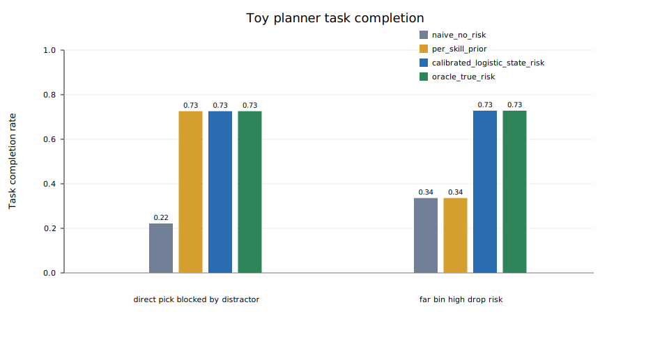
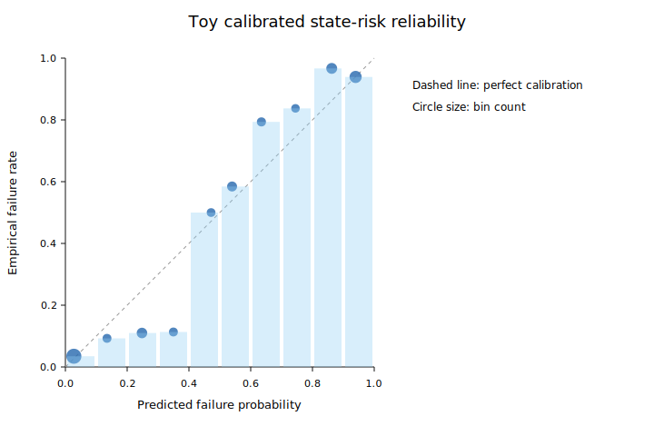

# Risk-Aware Skill Planning

[](https://github.com/sabdulmajid/robotics/actions/workflows/ci.yml)

Risk-aware execution for robot foundation policies, starting with OpenPI/LIBERO.

This repository is a research scaffold for a broader manipulation-planning project: long-horizon skill plans fail when they compose brittle skills, and a planner should make better choices when it has calibrated, state-conditioned estimates of skill failure risk. The immediate target is now **Risk-Aware Execution for OpenPI Robot Foundation Policies on LIBERO**. The existing toy domain remains a regression gate for planner/risk/calibration logic.

Current status:

- Toy symbolic risk-planning harness: implemented and tested.
- Oracle-risk planning gate: passing on two frozen stochastic scenarios.
- Learned toy risk model: implemented as a calibrated logistic baseline over stochastic toy rollouts.
- OpenPI/LIBERO setup: OpenPI is cloned under ignored `external/`, the LIBERO client venv is reproducible through SLURM, and strict setup smoke has passed on a `dualcard` GPU node.
- Real OpenPI/LIBERO rollout path: added a Python 3.8-compatible single-task evaluator that starts from OpenPI's upstream LIBERO evaluator and emits risk-ready JSONL logs.
- First real OpenPI policy smoke: `pi05_libero` completed one LIBERO-Spatial task-0 episode successfully on `dualcard` SLURM job `10092`; this is a smoke result, not a benchmark success-rate claim.
- Direct OpenPI baselines: `libero_spatial` tasks `0,1,2` reached `9/9` success with no stressor, `10/12` under mixed moderate occlusion/action-noise stress, and `1/9` under severe occlusion. These runs produce the first real failure regime for risk modeling.
- OpenPI risk critic: trained a transparent calibrated logistic baseline on `30` OpenPI/LIBERO episodes with a `20/10` success/failure split. This is an engineering checkpoint; fixed task priors remain strong and richer image/language/world-model features are the next research step.

This is TAMP-inspired symbolic skill planning. It is not a full PDDLStream implementation and does not provide a formal safety guarantee.

## OpenPI/LIBERO Target

The main project direction is to wrap OpenPI `pi05_libero` execution with calibrated risk prediction and adaptive supervision.

| Component | Role in this project | Status |
| --- | --- | --- |
| [OpenPI](https://github.com/Physical-Intelligence/openpi) | Primary robot foundation policy source, targeting `pi05_libero` and `gs://openpi-assets/checkpoints/pi05_libero/` | installed locally, setup smoke passed, first policy rollout passed |
| [LIBERO](https://github.com/Lifelong-Robot-Learning/LIBERO) | Main benchmark suite: `libero_spatial`, `libero_object`, `libero_goal`, `libero_10` | installed locally, client venv smoke passed, first episode log/video collected |
| VLM/image features | Frozen image/language embeddings for risk prediction from logged RGB frames and task prompts | planned next; OpenPI already provides the VLA policy backbone, but the current risk critic is structured/log-only |
| World model features | Learned progress/transition predictor from rollout logs for no-progress and likely-failure signals | planned next; current runner logs no-progress, action smoothness, rewards, and per-step images needed for this model |
| [LeRobot](https://github.com/huggingface/lerobot) | Optional dataset/export format and future policy baseline; OpenPI itself vendors LeRobot dependencies | planned ablation, not required for first OpenPI result |

Execution modes to evaluate once OpenPI smoke passes:

```text
direct_openpi
fixed_task_prior
learned_risk_openpi
selective_openpi
adaptive_chunk_openpi
no_progress_replan
```

The key intervention is `adaptive_chunk_openpi`: low predicted risk uses the normal action horizon, medium/high risk shortens the action horizon and re-queries OpenPI more often, and extreme/no-progress cases abstain or stop early.

Current OpenPI/LIBERO commands:

```bash
python -m risk_aware_skill_planning.cli openpi-libero-smoke --config configs/openpi_libero_smoke.yaml
python -m risk_aware_skill_planning.cli openpi-libero-smoke --config configs/openpi_libero_smoke.yaml --strict
python -m risk_aware_skill_planning.cli openpi-libero-summarize --input datasets/openpi_libero_rollouts/example.jsonl
python scripts/openpi_libero_single_task_eval.py --dry-run
PYTHONPATH=src python scripts/train_openpi_risk.py --config configs/openpi/train_risk.yaml
sbatch slurm/openpi_libero_smoke.sbatch
sbatch slurm/openpi_libero_official_smoke.sbatch
SUITES="libero_spatial libero_goal" TASK_IDS="0 1 2" NUM_TRIALS=3 sbatch slurm/openpi_libero_rollouts.sbatch
SUITES="libero_spatial" TASK_IDS="0 1 2" NUM_TRIALS=3 STRESSORS="occlusion" STRESSOR_SEVERITY=1.0 sbatch slurm/openpi_libero_rollouts.sbatch
MODE=adaptive_chunk_openpi RISK_SUMMARY=reports/openpi_libero_risk_summary.json SUITES="libero_spatial" TASK_IDS="0 1 2" NUM_TRIALS=2 STRESSORS="occlusion" STRESSOR_SEVERITY=1.0 sbatch slurm/openpi_libero_rollouts.sbatch
```

The non-strict smoke command writes a blocker/resume report even before OpenPI is installed. The strict form is the acceptance check for real OpenPI/LIBERO setup.
The official smoke starts OpenPI's policy server and runs one real `pi05_libero` episode through the filtered LIBERO evaluator.
The rollout job reuses the cached OpenPI server environment and checkpoint, then writes combined direct-policy JSONL for risk-model training. The risk summary can be passed back into the same rollout script for `selective_openpi` and `adaptive_chunk_openpi` supervisor evaluations.

Tracked first-rollout artifacts:

- [OpenPI/LIBERO official eval smoke report](reports/openpi_libero_official_eval_smoke.md)
- [Rollout JSONL sample](reports/artifacts/openpi_libero_official_smoke_10092.jsonl)
- [Success video](reports/artifacts/openpi_libero_official_smoke_10092_success.mp4)

Current OpenPI reports:

- [OpenPI/LIBERO risk training report](reports/openpi_libero_risk_planning.md)
- [Nominal direct rollout summary](reports/openpi_libero_rollout_summary_10094.json)
- [Moderate stress rollout summary](reports/openpi_libero_rollout_summary_10095.json)
- [Severe occlusion rollout summary](reports/openpi_libero_rollout_summary_10096.json)
- [Selective supervisor rollout summary](reports/openpi_libero_rollout_summary_10097.json)
- [Adaptive supervisor rollout summary](reports/openpi_libero_rollout_summary_10098.json)
- [Cross-suite direct rollout summary](reports/openpi_libero_rollout_summary_10099.json)
- [OpenPI project status and next-step plan](reports/openpi_project_status.md)
- [OpenPI/LIBERO setup guide](docs/openpi_libero_setup.md)
- [OpenPI experiment protocol](docs/openpi_experiment_protocol.md)

## Why This Exists

Manipulation systems often plan with skills that are only locally reliable. A shortest symbolic plan can be brittle when the initial state makes the next skill risky, for example picking through clutter or placing to a far target. This codebase locks the planner, risk-model, logging, and evaluation interfaces in a small stochastic simulator first, then uses that gate to decide whether it is worth moving to learned critics and robot simulation.

The hard gate is:

```text
Do not train neural risk critics until oracle-risk planning beats naive planning
in the frozen scenario suite.
```

The regression test makes this concrete: on each frozen toy scenario, `oracle_risk` must improve task completion by more than `0.25` and reduce catastrophic failure by more than `0.15` relative to both `naive_no_risk` and `fixed_per_skill_risk`.

## Implemented MVP

The toy environment exposes a low-dimensional symbolic state:

```text
object_blocked, object_far, gripper_empty, holding_object,
at_safe_pose, distractor_clear
```

Available skills:

```text
direct_pick, conservative_pick, move_distractor,
fast_place, slow_place, recover
```

Planner modes:

- `naive_no_risk`: ranks plans by action cost only.
- `fixed_per_skill_risk`: uses state-independent skill priors.
- `oracle_risk`: uses the toy ground-truth state-conditioned failure model.

The planner enumerates candidate symbolic plans, scores the next executable skill using the current state, logs all candidates, executes one skill, updates state, and replans.

Candidate plans are short in the current harness, usually two or three skills. The point of the MVP is not manipulation scale; it is to prove that the planner can exploit state-conditioned risk structure before moving to higher-fidelity environments.

## Toy Oracle Results

Configuration: [configs/toy_oracle_validation.yaml](configs/toy_oracle_validation.yaml), `500` episodes per scenario and planner mode, seeds `0..499`. Values are rates; parentheses show 95% bootstrap confidence intervals. Coverage is attempted episodes divided by total episodes; the default validation run is full coverage so planners are compared without abstention.

| Scenario | Planner | Task completion | Catastrophic failure | Coverage | Rejection |
| --- | --- | ---: | ---: | ---: | ---: |
| `direct_pick_blocked_by_distractor` | `naive_no_risk` | 0.224 (0.184-0.262) | 0.482 (0.444-0.530) | 1.000 | 0.000 |
| `direct_pick_blocked_by_distractor` | `fixed_per_skill_risk` | 0.224 (0.184-0.262) | 0.482 (0.444-0.530) | 1.000 | 0.000 |
| `direct_pick_blocked_by_distractor` | `oracle_risk` | 0.724 (0.680-0.772) | 0.076 (0.056-0.102) | 1.000 | 0.000 |
| `far_bin_high_drop_risk` | `naive_no_risk` | 0.338 (0.292-0.382) | 0.332 (0.294-0.382) | 1.000 | 0.000 |
| `far_bin_high_drop_risk` | `fixed_per_skill_risk` | 0.338 (0.292-0.382) | 0.332 (0.294-0.382) | 1.000 | 0.000 |
| `far_bin_high_drop_risk` | `oracle_risk` | 0.730 (0.692-0.766) | 0.092 (0.068-0.114) | 1.000 | 0.000 |

Interpretation:

- In the blocked-pick scenario, oracle risk steers the planner toward `move_distractor` before picking.
- In the far-target scenario, oracle risk steers placement toward the safer slow variant when the state makes fast placement drop-prone.
- The fixed-risk baseline does not help here because the failure modes are state-dependent by construction.
- These are oracle-risk toy results, not evidence that a learned critic is already calibrated or deployable.

A tracked result note is available in [reports/toy_oracle_validation.md](reports/toy_oracle_validation.md). The full generated JSON is written to `outputs/toy_oracle_validation_summary.json`.

## Learned Toy Risk Sanity Check

The oracle gate justifies training a lightweight learned risk model in the same toy domain. The current learned baseline uses synthetic stochastic toy rollouts with seed-disjoint train, calibration, and test splits:

- `global_prior`
- `per_skill_prior`
- `logistic_state_risk`
- `calibrated_logistic_state_risk`
- `oracle_true_risk`

Configuration: [configs/toy_risk_learning.yaml](configs/toy_risk_learning.yaml). Full metrics are tracked in [reports/toy_risk_learning.md](reports/toy_risk_learning.md).

| Model | Brier | NLL | ECE | AUROC | AUPRC |
| --- | ---: | ---: | ---: | ---: | ---: |
| `per_skill_prior` | 0.185 | 0.534 | 0.027 | 0.733 | 0.620 |
| `logistic_state_risk` | 0.125 | 0.415 | 0.161 | 0.933 | 0.907 |
| `calibrated_logistic_state_risk` | 0.100 | 0.342 | 0.064 | 0.933 | 0.907 |
| `oracle_true_risk` | 0.074 | 0.265 | 0.010 | 0.947 | 0.941 |

Planner impact at equal coverage:

| Scenario | `naive_no_risk` completion / safety failure | `per_skill_prior` completion / safety failure | `calibrated_logistic_state_risk` completion / safety failure |
| --- | ---: | ---: | ---: |
| `direct_pick_blocked_by_distractor` | 0.222 / 0.480 | 0.726 / 0.078 | 0.726 / 0.078 |
| `far_bin_high_drop_risk` | 0.336 / 0.332 | 0.336 / 0.332 | 0.728 / 0.094 |

The useful signal is the second scenario: state-conditioned risk identifies that fast placement is unsafe only in the far-target state, while a fixed per-skill prior cannot.





## Reproduce

Run from the repository root. The first command installs the package in editable mode and exposes the `rask` console script; without installation, prefix CLI commands with `PYTHONPATH=src`.

```bash
python -m pip install -e ".[dev]"
python -m pytest
python -m risk_aware_skill_planning.cli smoke
python -m risk_aware_skill_planning.cli dry-run --config configs/toy_oracle_validation.yaml
python -m risk_aware_skill_planning.cli toy-eval --config configs/toy_oracle_validation.yaml
python -m risk_aware_skill_planning.cli toy-risk-eval --config configs/toy_risk_learning.yaml
python -m risk_aware_skill_planning.cli openpi-libero-smoke --config configs/openpi_libero_smoke.yaml
python scripts/collect_openpi_libero.py --config configs/openpi/libero_collect_baseline.yaml
python scripts/eval_openpi_supervisor.py --config configs/openpi/eval_supervisor.yaml
python scripts/summarize_openpi_results.py --run-dir reports
python -m risk_aware_skill_planning.cli toy-trace \
  --scenario direct_pick_blocked_by_distractor \
  --planner-mode oracle_risk \
  --seed 0 \
  --output outputs/toy_trace_direct_pick_oracle.json
```

Expected verification:

- `pytest` checks deterministic reset, feature-spec validity, candidate-plan logging, threshold rejection, and the oracle-vs-naive/fixed gate.
- `smoke` imports the package, creates the toy simulator, resets the environment, and plans one step.
- `dry-run` validates the experiment config and prints sample candidate-plan logs.
- `toy-eval` regenerates the result JSON under `outputs/`.
- `toy-risk-eval` trains toy learned-risk baselines, writes a tracked report, and regenerates SVG figures.
- `openpi-libero-smoke` checks whether OpenPI/LIBERO is installed and writes exact blockers/resume commands.
- `openpi_libero_single_task_eval.py` runs under OpenPI's Python 3.8 LIBERO client environment and writes risk-ready JSONL plus videos.
- `train_openpi_risk.py` trains the OpenPI rollout risk critic, writes calibration metrics, and emits a risk summary loadable by the runtime supervisor.
- `toy-trace` writes a full per-episode trace, including candidate plans and selected skills.

## Code Map

| Path | Purpose |
| --- | --- |
| [src/risk_aware_skill_planning/contracts.py](src/risk_aware_skill_planning/contracts.py) | Shared `FeatureSpec`, `SkillCall`, `RolloutOutcome`, risk, planning, and episode schemas. |
| [src/risk_aware_skill_planning/envs/toy.py](src/risk_aware_skill_planning/envs/toy.py) | Toy symbolic simulator, frozen scenarios, stochastic execution, and oracle risk rules. |
| [src/risk_aware_skill_planning/skills/toy_skills.py](src/risk_aware_skill_planning/skills/toy_skills.py) | Skill definitions, costs, preconditions, and postconditions. |
| [src/risk_aware_skill_planning/risk/models.py](src/risk_aware_skill_planning/risk/models.py) | Zero-risk, fixed-risk, and oracle-risk model implementations. |
| [src/risk_aware_skill_planning/planning/toy_planner.py](src/risk_aware_skill_planning/planning/toy_planner.py) | Candidate-plan enumeration, risk-aware scoring, rejection, and receding-horizon execution. |
| [src/risk_aware_skill_planning/evaluation/metrics.py](src/risk_aware_skill_planning/evaluation/metrics.py) | Coverage-aware success, rejection, catastrophic failure, utility, and CI metrics. |
| [src/risk_aware_skill_planning/evaluation/risk_eval.py](src/risk_aware_skill_planning/evaluation/risk_eval.py) | Toy learned-risk training, calibration, skill metrics, and planner impact evaluation. |
| [src/risk_aware_skill_planning/openpi_libero](src/risk_aware_skill_planning/openpi_libero) | OpenPI/LIBERO setup boundary, rollout schema, summarization, and supervisor decisions. |
| [src/risk_aware_skill_planning/backends/openpi](src/risk_aware_skill_planning/backends/openpi) | OpenPI backend configs, stressor validation, command construction, action-horizon policy, and log-schema validation. |
| [src/risk_aware_skill_planning/supervision](src/risk_aware_skill_planning/supervision) | Runtime supervisor decisions, adaptive chunking, and no-progress windows. |
| [src/risk_aware_skill_planning/risk/openpi_dataset.py](src/risk_aware_skill_planning/risk/openpi_dataset.py) | Converts OpenPI/LIBERO JSONL episodes into risk examples with train/calibration/test splits. |
| [src/risk_aware_skill_planning/evaluation/openpi_risk.py](src/risk_aware_skill_planning/evaluation/openpi_risk.py) | Trains/calibrates the OpenPI risk critic and writes the current robot-policy report. |
| [scripts/openpi_libero_single_task_eval.py](scripts/openpi_libero_single_task_eval.py) | Python 3.8-compatible OpenPI/LIBERO evaluator with stressors, JSONL logging, videos, and runtime risk-supervisor modes. |
| [src/risk_aware_skill_planning/cli.py](src/risk_aware_skill_planning/cli.py) | Smoke, dry-run, evaluation, and trace command entry points. |
| [tests/test_toy_harness.py](tests/test_toy_harness.py) | Regression tests for the toy gate and planner behavior. |

## SLURM Smoke Tests

The toy smoke job uses the requested project cluster defaults: `midcard`, `gpu:1`, `4` CPUs, and `24G` memory. It is CPU-light despite requesting a GPU, so edit the partition and `gres` lines if running on a different cluster.

```bash
sbatch slurm/smoke_test.sbatch
sbatch slurm/openpi_libero_smoke.sbatch
sbatch slurm/openpi_libero_official_smoke.sbatch
```

## Output Policy

Generated artifacts should stay under repo-managed directories:

```text
outputs/       generated evaluation JSON and logs
checkpoints/   model checkpoints
datasets/      generated datasets
videos/        rollout videos
reports/       tracked summaries and final report assets
```

## Limitations

- The current OpenPI/LIBERO result is a small rollout study, not a benchmark-scale manipulation evaluation.
- `oracle_risk` uses the toy simulator's ground-truth risk rules. The real OpenPI risk model is still a transparent logistic baseline.
- The current OpenPI risk features include stressor metadata for controlled stress testing. The professional research path is to replace that with directly observed VLM/image and world-model progress features.
- OpenPI/LIBERO setup smoke and the one-episode official policy smoke are passing, and small direct-policy baselines are logged, but no benchmark-level OpenPI success-rate result is claimed yet.
- No robosuite environment, learned manipulation policy, robosuite risk critic, or video demo is implemented yet.
- Rejection is implemented and tested, but the default oracle validation configuration accepts all episodes to compare planners at equal coverage.

## Roadmap

1. Finish selective/adaptive supervisor comparisons under severe occlusion and report coverage-aware outcomes.
2. Expand direct OpenPI LIBERO rollout logs across spatial/object/goal/10 suites.
3. Add frozen VLM image/language embeddings as a state-conditioned risk ablation.
4. Train a lightweight world-model/progress predictor and compare it to structured-only risk features.
5. Compare OpenPI-only, OpenPI plus risk supervisor, fixed task prior, and LeRobot-format/export baselines.
6. Keep toy oracle and learned-risk gates as regression tests.
