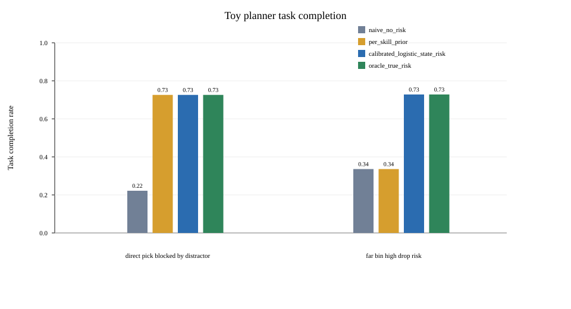
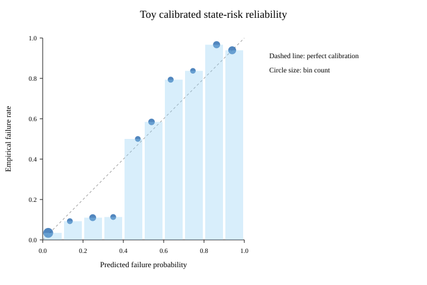

# Risk-Aware Skill Planning

[](https://github.com/sabdulmajid/robotics/actions/workflows/ci.yml)

This project tests risk-aware execution for OpenPI robot policies on LIBERO.

The runtime supervisor uses a frozen SigLIP image embedding and 10 steps of observable progress data.

It rejects an episode when predicted failure risk is above a frozen threshold.

The repository contains 3,080 held-out online comparison episodes.

The strongest result is a robust reduction in attempted failures on LIBERO Spatial.

| Mode | Coverage | Completion | Attempted failure | Utility |
| --- | ---: | ---: | ---: | ---: |
| Direct OpenPI | 1.000 | 0.661 | 0.339 | 0.477 |
| SigLIP threshold 0.9860 | 0.803 | 0.637 | 0.206 | 0.504 |

The attempted-failure delta is `-0.133`, with a 95% interval of `[-0.181, -0.083]`.

The utility delta is `0.027`, with an interval of `[-0.029, 0.076]`.

Thus, the failure reduction is robust, but the utility gain is not robust.

A new retrospective cross-suite test selects threshold `0.8711` on tasks `5..6`.

On tasks `7..9`, attempted failure falls from `0.244` to `0.033`.

Utility falls from `0.617` to `0.558`.

The threshold rejects all severe-occlusion episodes.

This result shows that the current VLM score acts primarily as a coarse occlusion detector.

Overall test AUROC is `0.858`, but AUROC across 30 severe-occlusion episodes is only `0.335`.

This stratified result shows that condition separation drives most of the aggregate discrimination.

See [PROJECT_STATUS.md](PROJECT_STATUS.md) for the evidence ledger, limits, open-source components, and next experiment.

The public status documents use an [ASD-STE100-style writing guide](docs/STE_STYLE.md).

This project does not provide a formal safety guarantee.

## OpenPI/LIBERO Target

The main project direction is to wrap OpenPI `pi05_libero` execution with calibrated risk prediction and adaptive supervision.

| Component | Role in this project | Status |
| --- | --- | --- |
| [OpenPI](https://github.com/Physical-Intelligence/openpi) | Primary robot foundation policy source, targeting `pi05_libero` and `gs://openpi-assets/checkpoints/pi05_libero/` | installed locally, setup smoke passed, first policy rollout passed |
| [LIBERO](https://github.com/Lifelong-Robot-Learning/LIBERO) | Main benchmark suite: `libero_spatial`, `libero_object`, `libero_goal`, `libero_10` | active; 993 direct OpenPI episodes logged across suites/stressors |
| VLM/image features | Frozen SigLIP image embeddings for risk prediction from logged RGB frames/videos and task context | active offline and runtime ablation with `google/siglip-base-patch16-224` |
| World model features | Progress/transition signals for no-progress and likely-timeout risk | 10-step prefix statistics active; learned predictive dynamics planned |
| [LeRobot](https://github.com/huggingface/lerobot) | Optional dataset/export format and future policy baseline; OpenPI itself vendors LeRobot dependencies | planned export/baseline, not used in current metrics |

Execution and supervision modes:

```text
direct_openpi
fixed_task_prior
learned_risk_openpi
selective_openpi
adaptive_chunk_openpi
no_progress_replan
fixed_task_prior_selective
vision_language_risk_selective
```

The current online intervention is `vision_language_risk_selective`: it uses a runtime RGB frame plus early progress features to reject high-risk executions before the full episode is attempted. `adaptive_chunk_openpi` remains available as a lower-level control experiment: low predicted risk uses the normal action horizon, medium/high risk shortens the action horizon and re-queries OpenPI more often, and extreme/no-progress cases abstain or stop early.

Current OpenPI/LIBERO commands:

```bash
python -m risk_aware_skill_planning.cli openpi-libero-smoke --config configs/openpi_libero_smoke.yaml
python -m risk_aware_skill_planning.cli openpi-libero-smoke --config configs/openpi_libero_smoke.yaml --strict
python -m risk_aware_skill_planning.cli openpi-libero-summarize --input datasets/openpi_libero_rollouts/example.jsonl
python scripts/openpi_libero_single_task_eval.py --dry-run
PYTHONPATH=src python scripts/extract_openpi_siglip_embeddings.py --config configs/openpi/train_risk.yaml --output outputs/openpi_libero/siglip_episode_embeddings.jsonl --dims 64
PYTHONPATH=src python scripts/train_openpi_risk.py --config configs/openpi/train_risk.yaml
sbatch slurm/openpi_libero_smoke.sbatch
sbatch slurm/openpi_libero_official_smoke.sbatch
SUITES="libero_spatial libero_goal" TASK_IDS="0 1 2" NUM_TRIALS=3 sbatch slurm/openpi_libero_rollouts.sbatch
SUITES="libero_spatial" TASK_IDS="0 1 2" NUM_TRIALS=3 STRESSORS="occlusion" STRESSOR_SEVERITY=1.0 sbatch slurm/openpi_libero_rollouts.sbatch
SUITES="libero_spatial libero_object libero_goal libero_10" TASK_IDS="0 1 2 3 4 5 6 7 8 9" NUM_TRIALS=10 STRESSORS="none" sbatch slurm/openpi_libero_rollouts.sbatch
SUITES="libero_spatial" TASK_IDS="0 1 2 3 4 5 6 7 8 9" NUM_TRIALS=7 STRESSORS="occlusion action_noise" STRESSOR_SEVERITY=0.6 sbatch slurm/openpi_libero_rollouts.sbatch
SAVE_IMAGES=1 SUITES="libero_spatial" TASK_IDS="0" NUM_TRIALS=1 STRESSORS="none" sbatch slurm/openpi_libero_rollouts.sbatch
MODE=adaptive_chunk_openpi RISK_SUMMARY=reports/openpi_libero_risk_summary.json SUITES="libero_spatial" TASK_IDS="0 1 2" NUM_TRIALS=2 STRESSORS="occlusion" STRESSOR_SEVERITY=1.0 sbatch slurm/openpi_libero_rollouts.sbatch
MODE=vision_language_risk_selective RISK_SUMMARY=reports/openpi_libero_risk_summary.json SUITES="libero_spatial" TASK_IDS="0 1 2 3 4 5 6 7 8 9" NUM_TRIALS=3 STRESSORS="occlusion" STRESSOR_SEVERITY=0.8 SEED=2000 OPENPI_INSTALL_VISION_DEPS=1 sbatch slurm/openpi_libero_rollouts.sbatch
PYTHONPATH=src python scripts/summarize_openpi_runtime_eval.py --input 'datasets/openpi_libero_rollouts/openpi_rollouts_1013[3-9].jsonl' --input 'datasets/openpi_libero_rollouts/openpi_rollouts_1014[0-7].jsonl'
PYTHONPATH=src python scripts/sweep_openpi_runtime_thresholds.py --input 'datasets/openpi_libero_rollouts/openpi_rollouts_1013[3-9].jsonl' --input 'datasets/openpi_libero_rollouts/openpi_rollouts_1014[0-7].jsonl'
RUNTIME_RISK_THRESHOLD_OVERRIDE=0.9333276460818999 MODE=vision_language_risk_selective RISK_SUMMARY=reports/openpi_libero_risk_summary.json SUITES="libero_spatial" TASK_IDS="5 6 7 8 9" NUM_TRIALS=3 STRESSORS="occlusion action_noise" STRESSOR_SEVERITY=0.6 SEED=3000 OPENPI_INSTALL_VISION_DEPS=1 sbatch slurm/openpi_libero_rollouts.sbatch
PYTHONPATH=src python scripts/summarize_openpi_controlled_deployment.py --manifest reports/openpi_controlled_deployment_jobs_seed4000.jsonl --output reports/openpi_runtime_controlled_deployment_summary.json
PYTHONPATH=src python scripts/summarize_openpi_multiseed_deployment.py --manifest reports/openpi_multiseed_spatial_jobs.jsonl --manifest reports/openpi_cross_suite_jobs_seed5000.jsonl --output reports/openpi_runtime_multiseed_summary.json
PYTHONPATH=src python scripts/analyze_openpi_cross_suite_retrospective.py
python scripts/plot_openpi_cross_suite_retrospective.py
python scripts/check_ste_docs.py
```

The non-strict smoke command writes a blocker/resume report even before OpenPI is installed. The strict form is the acceptance check for real OpenPI/LIBERO setup.
The official smoke starts OpenPI's policy server and runs one real `pi05_libero` episode through the filtered LIBERO evaluator.
The rollout job reuses the cached OpenPI server environment and checkpoint, then writes combined direct-policy JSONL for risk-model training. The SigLIP extraction script converts the existing rollout videos into ignored frozen embedding artifacts under `outputs/`, and the risk summary can be passed back into the same rollout script for `selective_openpi` and `adaptive_chunk_openpi` supervisor evaluations.
Runtime `vision_language_risk_selective` captures a post-stressor RGB frame, computes a frozen SigLIP embedding, combines it with the observable 10-step progress prefix, and abstains when predicted failure risk exceeds the selected threshold. The threshold sweep uses runtime calibration tasks `0..4` and evaluates on held-out test tasks `5..9`.

Tracked first-rollout artifacts:

- [OpenPI/LIBERO official eval smoke report](reports/openpi_libero_official_eval_smoke.md)
- [Rollout JSONL sample](reports/artifacts/openpi_libero_official_smoke_10092.jsonl)
- [Success video](reports/artifacts/openpi_libero_official_smoke_10092_success.mp4)

Current OpenPI reports:

- [OpenPI/LIBERO risk training report](reports/openpi_libero_risk_planning.md)
- [Nominal direct rollout summary](reports/openpi_libero_rollout_summary_10094.json)
- [Moderate stress rollout summary](reports/openpi_libero_rollout_summary_10095.json)
- [Severe occlusion rollout summary](reports/openpi_libero_rollout_summary_10096.json)
- [Selective supervisor rollout summary](reports/openpi_libero_rollout_summary_10097.json)
- [Adaptive supervisor rollout summary](reports/openpi_libero_rollout_summary_10098.json)
- [Cross-suite direct rollout summary](reports/openpi_libero_rollout_summary_10099.json)
- [Scaled nominal direct summary A](reports/openpi_libero_rollout_summary_10120.json)
- [Scaled nominal direct summary B](reports/openpi_libero_rollout_summary_10121.json)
- [Stress severity 0.2 summary](reports/openpi_libero_rollout_summary_10127.json)
- [Stress severity 0.4 summary](reports/openpi_libero_rollout_summary_10128.json)
- [Stress severity 0.6 summary](reports/openpi_libero_rollout_summary_10129.json)
- [Stress severity 0.8 summary](reports/openpi_libero_rollout_summary_10130.json)
- [Stress severity 1.0 summary](reports/openpi_libero_rollout_summary_10131.json)
- [Runtime SigLIP supervisor summary](reports/openpi_runtime_siglip_eval_summary.json)
- [Tuned-threshold deployment summary](reports/openpi_tuned_threshold_deployment_10148.json)
- [Same-seed controlled deployment summary](reports/openpi_runtime_controlled_deployment_summary.json)
- [Multiseed and cross-suite controlled summary](reports/openpi_runtime_multiseed_summary.json)
- [Retrospective cross-suite threshold summary](reports/openpi_cross_suite_retrospective_threshold_summary.json)
- [Online follow-up infrastructure status](reports/openpi_cross_suite_online_followup_status.json)
- [OpenPI project status and next-step plan](reports/openpi_project_status.md)
- [OpenPI/LIBERO setup guide](docs/openpi_libero_setup.md)
- [OpenPI experiment protocol](docs/openpi_experiment_protocol.md)

## Why This Exists

Manipulation systems often plan with skills that are only locally reliable. A shortest symbolic plan can be brittle when the initial state makes the next skill risky, for example picking through clutter or placing to a far target. This codebase locks the planner, risk-model, logging, and evaluation interfaces in a small stochastic simulator first, then uses that gate to decide whether it is worth moving to learned critics and robot simulation.

The hard gate is:

```text
Do not train neural risk critics until oracle-risk planning beats naive planning
in the frozen scenario suite.
```

The regression test makes this concrete: on each frozen toy scenario, `oracle_risk` must improve task completion by more than `0.25` and reduce catastrophic failure by more than `0.15` relative to both `naive_no_risk` and `fixed_per_skill_risk`.

## Implemented MVP

The toy environment exposes a low-dimensional symbolic state:

```text
object_blocked, object_far, gripper_empty, holding_object,
at_safe_pose, distractor_clear
```

Available skills:

```text
direct_pick, conservative_pick, move_distractor,
fast_place, slow_place, recover
```

Planner modes:

- `naive_no_risk`: ranks plans by action cost only.
- `fixed_per_skill_risk`: uses state-independent skill priors.
- `oracle_risk`: uses the toy ground-truth state-conditioned failure model.

The planner enumerates candidate symbolic plans, scores the next executable skill using the current state, logs all candidates, executes one skill, updates state, and replans.

Candidate plans are short in the current harness, usually two or three skills. The point of the MVP is not manipulation scale; it is to prove that the planner can exploit state-conditioned risk structure before moving to higher-fidelity environments.

## Toy Oracle Results

Configuration: [configs/toy_oracle_validation.yaml](configs/toy_oracle_validation.yaml), `500` episodes per scenario and planner mode, seeds `0..499`. Values are rates; parentheses show 95% bootstrap confidence intervals. Coverage is attempted episodes divided by total episodes; the default validation run is full coverage so planners are compared without abstention.

| Scenario | Planner | Task completion | Catastrophic failure | Coverage | Rejection |
| --- | --- | ---: | ---: | ---: | ---: |
| `direct_pick_blocked_by_distractor` | `naive_no_risk` | 0.224 (0.184-0.262) | 0.482 (0.444-0.530) | 1.000 | 0.000 |
| `direct_pick_blocked_by_distractor` | `fixed_per_skill_risk` | 0.224 (0.184-0.262) | 0.482 (0.444-0.530) | 1.000 | 0.000 |
| `direct_pick_blocked_by_distractor` | `oracle_risk` | 0.724 (0.680-0.772) | 0.076 (0.056-0.102) | 1.000 | 0.000 |
| `far_bin_high_drop_risk` | `naive_no_risk` | 0.338 (0.292-0.382) | 0.332 (0.294-0.382) | 1.000 | 0.000 |
| `far_bin_high_drop_risk` | `fixed_per_skill_risk` | 0.338 (0.292-0.382) | 0.332 (0.294-0.382) | 1.000 | 0.000 |
| `far_bin_high_drop_risk` | `oracle_risk` | 0.730 (0.692-0.766) | 0.092 (0.068-0.114) | 1.000 | 0.000 |

Interpretation:

- In the blocked-pick scenario, oracle risk steers the planner toward `move_distractor` before picking.
- In the far-target scenario, oracle risk steers placement toward the safer slow variant when the state makes fast placement drop-prone.
- The fixed-risk baseline does not help here because the failure modes are state-dependent by construction.
- These are oracle-risk toy results, not evidence that a learned critic is already calibrated or deployable.

A tracked result note is available in [reports/toy_oracle_validation.md](reports/toy_oracle_validation.md). The full generated JSON is written to `outputs/toy_oracle_validation_summary.json`.

## Learned Toy Risk Sanity Check

The oracle gate justifies training a lightweight learned risk model in the same toy domain. The current learned baseline uses synthetic stochastic toy rollouts with seed-disjoint train, calibration, and test splits:

- `global_prior`
- `per_skill_prior`
- `logistic_state_risk`
- `calibrated_logistic_state_risk`
- `oracle_true_risk`

Configuration: [configs/toy_risk_learning.yaml](configs/toy_risk_learning.yaml). Full metrics are tracked in [reports/toy_risk_learning.md](reports/toy_risk_learning.md).

| Model | Brier | NLL | ECE | AUROC | AUPRC |
| --- | ---: | ---: | ---: | ---: | ---: |
| `per_skill_prior` | 0.185 | 0.534 | 0.027 | 0.733 | 0.620 |
| `logistic_state_risk` | 0.125 | 0.415 | 0.161 | 0.933 | 0.907 |
| `calibrated_logistic_state_risk` | 0.100 | 0.342 | 0.064 | 0.933 | 0.907 |
| `oracle_true_risk` | 0.074 | 0.265 | 0.010 | 0.947 | 0.941 |

Planner impact at equal coverage:

| Scenario | `naive_no_risk` completion / safety failure | `per_skill_prior` completion / safety failure | `calibrated_logistic_state_risk` completion / safety failure |
| --- | ---: | ---: | ---: |
| `direct_pick_blocked_by_distractor` | 0.222 / 0.480 | 0.726 / 0.078 | 0.726 / 0.078 |
| `far_bin_high_drop_risk` | 0.336 / 0.332 | 0.336 / 0.332 | 0.728 / 0.094 |

The useful signal is the second scenario: state-conditioned risk identifies that fast placement is unsafe only in the far-target state, while a fixed per-skill prior cannot.





## Reproduce

Run from the repository root. The first command installs the package in editable mode and exposes the `rask` console script; without installation, prefix CLI commands with `PYTHONPATH=src`.

```bash
python -m pip install -e ".[dev]"
python -m pytest
python -m risk_aware_skill_planning.cli smoke
python -m risk_aware_skill_planning.cli dry-run --config configs/toy_oracle_validation.yaml
python -m risk_aware_skill_planning.cli toy-eval --config configs/toy_oracle_validation.yaml
python -m risk_aware_skill_planning.cli toy-risk-eval --config configs/toy_risk_learning.yaml
python -m risk_aware_skill_planning.cli openpi-libero-smoke --config configs/openpi_libero_smoke.yaml
python scripts/collect_openpi_libero.py --config configs/openpi/libero_collect_baseline.yaml
python scripts/eval_openpi_supervisor.py --config configs/openpi/eval_supervisor.yaml
python scripts/summarize_openpi_results.py --run-dir reports
python -m risk_aware_skill_planning.cli toy-trace \
  --scenario direct_pick_blocked_by_distractor \
  --planner-mode oracle_risk \
  --seed 0 \
  --output outputs/toy_trace_direct_pick_oracle.json
```

Expected verification:

- `pytest` checks deterministic reset, feature-spec validity, candidate-plan logging, threshold rejection, and the oracle-vs-naive/fixed gate.
- `smoke` imports the package, creates the toy simulator, resets the environment, and plans one step.
- `dry-run` validates the experiment config and prints sample candidate-plan logs.
- `toy-eval` regenerates the result JSON under `outputs/`.
- `toy-risk-eval` trains toy learned-risk baselines, writes a tracked report, and regenerates SVG figures.
- `openpi-libero-smoke` checks whether OpenPI/LIBERO is installed and writes exact blockers/resume commands.
- `openpi_libero_single_task_eval.py` runs under OpenPI's Python 3.8 LIBERO client environment and writes risk-ready JSONL plus videos.
- `train_openpi_risk.py` trains the OpenPI rollout risk critic, writes calibration metrics, and emits a risk summary loadable by the runtime supervisor.
- `toy-trace` writes a full per-episode trace, including candidate plans and selected skills.

## Code Map

| Path | Purpose |
| --- | --- |
| [src/risk_aware_skill_planning/contracts.py](src/risk_aware_skill_planning/contracts.py) | Shared `FeatureSpec`, `SkillCall`, `RolloutOutcome`, risk, planning, and episode schemas. |
| [src/risk_aware_skill_planning/envs/toy.py](src/risk_aware_skill_planning/envs/toy.py) | Toy symbolic simulator, frozen scenarios, stochastic execution, and oracle risk rules. |
| [src/risk_aware_skill_planning/skills/toy_skills.py](src/risk_aware_skill_planning/skills/toy_skills.py) | Skill definitions, costs, preconditions, and postconditions. |
| [src/risk_aware_skill_planning/risk/models.py](src/risk_aware_skill_planning/risk/models.py) | Zero-risk, fixed-risk, and oracle-risk model implementations. |
| [src/risk_aware_skill_planning/planning/toy_planner.py](src/risk_aware_skill_planning/planning/toy_planner.py) | Candidate-plan enumeration, risk-aware scoring, rejection, and receding-horizon execution. |
| [src/risk_aware_skill_planning/evaluation/metrics.py](src/risk_aware_skill_planning/evaluation/metrics.py) | Coverage-aware success, rejection, catastrophic failure, utility, and CI metrics. |
| [src/risk_aware_skill_planning/evaluation/risk_eval.py](src/risk_aware_skill_planning/evaluation/risk_eval.py) | Toy learned-risk training, calibration, skill metrics, and planner impact evaluation. |
| [src/risk_aware_skill_planning/openpi_libero](src/risk_aware_skill_planning/openpi_libero) | OpenPI/LIBERO setup boundary, rollout schema, summarization, and supervisor decisions. |
| [src/risk_aware_skill_planning/backends/openpi](src/risk_aware_skill_planning/backends/openpi) | OpenPI backend configs, stressor validation, command construction, action-horizon policy, and log-schema validation. |
| [src/risk_aware_skill_planning/supervision](src/risk_aware_skill_planning/supervision) | Runtime supervisor decisions, adaptive chunking, and no-progress windows. |
| [src/risk_aware_skill_planning/risk/openpi_dataset.py](src/risk_aware_skill_planning/risk/openpi_dataset.py) | Converts OpenPI/LIBERO JSONL episodes into risk examples with train/calibration/test splits. |
| [src/risk_aware_skill_planning/evaluation/openpi_risk.py](src/risk_aware_skill_planning/evaluation/openpi_risk.py) | Trains/calibrates the OpenPI risk critic and writes the current robot-policy report. |
| [scripts/openpi_libero_single_task_eval.py](scripts/openpi_libero_single_task_eval.py) | Python 3.8-compatible OpenPI/LIBERO evaluator with stressors, JSONL logging, videos, and runtime risk-supervisor modes. |
| [src/risk_aware_skill_planning/cli.py](src/risk_aware_skill_planning/cli.py) | Smoke, dry-run, evaluation, and trace command entry points. |
| [tests/test_toy_harness.py](tests/test_toy_harness.py) | Regression tests for the toy gate and planner behavior. |

## SLURM Smoke Tests

The toy smoke job uses the requested project cluster defaults: `midcard`, `gpu:1`, `4` CPUs, and `24G` memory. It is CPU-light despite requesting a GPU, so edit the partition and `gres` lines if running on a different cluster.

```bash
sbatch slurm/smoke_test.sbatch
sbatch slurm/openpi_libero_smoke.sbatch
sbatch slurm/openpi_libero_official_smoke.sbatch
```

## Output Policy

Generated artifacts should stay under repo-managed directories:

```text
outputs/       generated evaluation JSON and logs
checkpoints/   model checkpoints
datasets/      generated datasets
videos/        rollout videos
reports/       tracked summaries and final report assets
```

## Limitations

- The current OpenPI/LIBERO result is a risk-supervision study, not a benchmark-scale OpenPI leaderboard claim.
- `oracle_risk` uses the toy simulator's ground-truth risk rules. The real OpenPI risk model is still a transparent logistic baseline.
- The `metadata_oracle_risk` OpenPI model includes stressor metadata and is diagnostic only. The deployable `structured_progress_risk` and `vision_language_risk` ablations exclude hidden stressor metadata.
- The structured-only risk model is useful but not decisive: it improves AUROC over fixed task priors, while fixed priors remain stronger on AUPRC/Brier in the current split.
- The SigLIP VLM result is now an online runtime supervisor, but it uses a frozen first-frame embedding plus prefix statistics. It is not a finetuned VLM policy.
- The multiseed online result robustly reduces attempted failures, but the utility gain is fragile: the spatial utility delta is positive on point estimate and still crosses zero in the bootstrap CI; cross-suite utility is lower than direct OpenPI.
- The retrospective cross-suite threshold rejects every severe-occlusion test episode. It does not rank risk within that condition.
- The retrospective test reuses reported episodes. It is a diagnostic result, not a fresh online deployment.
- Learned world-model dynamics are still planned; current world-model evidence is limited to prefix progress, action smoothness, no-progress, and reward statistics.
- No custom robosuite environment, learned manipulation policy, or neural robosuite risk critic is implemented yet.
- Rejection is implemented and tested, but the default oracle validation configuration accepts all episodes to compare planners at equal coverage.

## Roadmap

1. Run the prepared fresh cross-suite calibration and deployment protocol when cluster GPU access is restored.
2. Compare direct OpenPI, spatial threshold `0.9860`, and the frozen cross-suite threshold on seed `8000`.
3. Train a temporal progress head that can rank risk within severe occlusion.
4. Compare that head with the frozen first-frame SigLIP model.
5. Add a LeRobot-format export after the dataset contract is stable.
