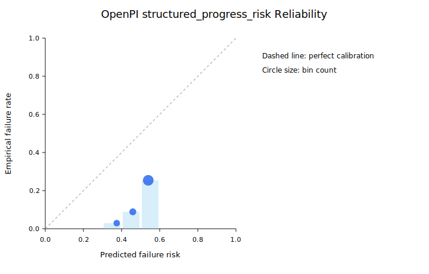
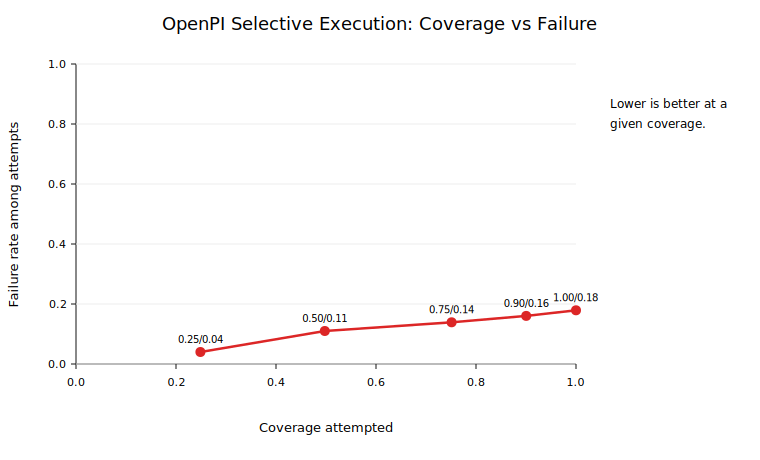

# OpenPI/LIBERO Risk Training

Status: `PASS`

This report is the current robot-foundation-policy checkpoint for the project. OpenPI `pi05_libero` is used as the vision-language-action policy, LIBERO supplies the manipulation tasks, and this layer learns rollout-level failure-risk models for selective execution and adaptive action chunking.

## Dataset

The risk dataset is built from direct OpenPI/LIBERO rollouts. Each row is one episode converted into initial/task/stressor features plus early rollout progress statistics; labels mark any terminal failure or timeout.

```json
{
  "all": {
    "examples": 993,
    "failure_rate": 0.17522658610271905,
    "failures": 174,
    "timeout_rate": 0.17522658610271905,
    "timeouts": 174
  },
  "calibration": {
    "examples": 197,
    "failure_rate": 0.17258883248730963,
    "failures": 34,
    "timeout_rate": 0.17258883248730963,
    "timeouts": 34
  },
  "test": {
    "examples": 201,
    "failure_rate": 0.1791044776119403,
    "failures": 36,
    "timeout_rate": 0.1791044776119403,
    "timeouts": 36
  },
  "train": {
    "examples": 595,
    "failure_rate": 0.17478991596638654,
    "failures": 104,
    "timeout_rate": 0.17478991596638654,
    "timeouts": 104
  }
}
```

Dataset coverage:

```json
{
  "by_stressor": {
    "action_noise": 216,
    "none": 412,
    "occlusion": 365
  },
  "by_stressor_severity": {
    "action_noise:0.20": 70,
    "action_noise:0.40": 70,
    "action_noise:0.60": 70,
    "action_noise:0.70": 6,
    "none:0.00": 412,
    "occlusion:0.20": 70,
    "occlusion:0.40": 70,
    "occlusion:0.60": 70,
    "occlusion:0.70": 6,
    "occlusion:0.80": 70,
    "occlusion:1.00": 79
  },
  "by_suite": {
    "libero_10": 101,
    "libero_goal": 101,
    "libero_object": 101,
    "libero_spatial": 690
  },
  "by_suite_stressor": {
    "libero_10": {
      "none": 101
    },
    "libero_goal": {
      "none": 101
    },
    "libero_object": {
      "none": 101
    },
    "libero_spatial": {
      "action_noise": 216,
      "none": 109,
      "occlusion": 365
    }
  },
  "by_task": {
    "libero_10:task00": 11,
    "libero_10:task01": 10,
    "libero_10:task02": 10,
    "libero_10:task03": 10,
    "libero_10:task04": 10,
    "libero_10:task05": 10,
    "libero_10:task06": 10,
    "libero_10:task07": 10,
    "libero_10:task08": 10,
    "libero_10:task09": 10,
    "libero_goal:task00": 11,
    "libero_goal:task01": 10,
    "libero_goal:task02": 10,
    "libero_goal:task03": 10,
    "libero_goal:task04": 10,
    "libero_goal:task05": 10,
    "libero_goal:task06": 10,
    "libero_goal:task07": 10,
    "libero_goal:task08": 10,
    "libero_goal:task09": 10,
    "libero_object:task00": 11,
    "libero_object:task01": 10,
    "libero_object:task02": 10,
    "libero_object:task03": 10,
    "libero_object:task04": 10,
    "libero_object:task05": 10,
    "libero_object:task06": 10,
    "libero_object:task07": 10,
    "libero_object:task08": 10,
    "libero_object:task09": 10,
    "libero_spatial:task00": 76,
    "libero_spatial:task01": 76,
    "libero_spatial:task02": 76,
    "libero_spatial:task03": 66,
    "libero_spatial:task04": 66,
    "libero_spatial:task05": 66,
    "libero_spatial:task06": 66,
    "libero_spatial:task07": 66,
    "libero_spatial:task08": 66,
    "libero_spatial:task09": 66
  },
  "episodes": 993,
  "failures": 174,
  "gpu_models": {
    "NVIDIA RTX A4500": 993
  },
  "run_ids": 19,
  "successes": 819
}
```

## Calibration

Temperature scaling selected `T=1.5` and planner threshold `0.5905054457889825` on the calibration split.

```json
{
  "method": "temperature_scaling_grid",
  "temperature": 1.5,
  "threshold": 0.5905054457889825
}
```

## Test Metrics

| Model | AUROC | AUPRC | Brier | NLL | ECE | Coverage @ threshold | Failure rate attempted |
| --- | ---: | ---: | ---: | ---: | ---: | ---: | ---: |
| global prior | 0.500 | 0.179 | 0.147 | 0.470 | 0.004 | 1.000 | 0.179 |
| fixed task prior | 0.695 | 0.347 | 0.139 | 0.690 | 0.062 | 1.000 | 0.179 |
| structured_progress_risk | 0.702 | 0.297 | 0.238 | 0.668 | 0.315 | 1.000 | 0.179 |

Model ablations:

| Variant | Status | Stressor metadata | Test AUROC | Test AUPRC | Test ECE | Coverage @ threshold | Note |
| --- | --- | ---: | ---: | ---: | ---: | ---: | --- |
| `metadata_oracle_risk` | trained | True | 0.930 | 0.840 | 0.264 | 0.821 | Diagnostic upper-bound model that is allowed to see controlled stressor metadata. It should not be treated as deployable risk perception. |
| `structured_progress_risk` | trained | False | 0.702 | 0.297 | 0.315 | 1.000 | Deployable structured baseline using task/language hashes, action horizon, and early rollout progress statistics, with hidden stressor metadata removed. |
| `vision_language_risk` | skipped | False | n/a | n/a | n/a | n/a | Rerun a subset with --save-images or add an embedding extraction pass before claiming VLM risk results. |

Offline policy comparison at matched coverage:

| Policy | Status | Coverage | Task completion | Failure attempted | Rejection | Note |
| --- | --- | ---: | ---: | ---: | ---: | --- |
| `direct_openpi` | evaluated | 1.000 | 0.821 | 0.179 | 0.000 |  |
| `global_prior_selective` | evaluated | 0.900 | 0.736 | 0.182 | 0.100 |  |
| `fixed_task_prior_selective` | evaluated | 0.900 | 0.771 | 0.144 | 0.100 |  |
| `metadata_oracle_risk_selective` | evaluated | 0.900 | 0.821 | 0.088 | 0.100 |  |
| `structured_progress_risk_selective` | evaluated | 0.900 | 0.756 | 0.160 | 0.100 |  |
| `vision_language_risk_selective` | skipped | n/a | n/a | n/a | n/a | Rerun a subset with --save-images or add an embedding extraction pass before claiming VLM risk results. |





The metadata-aware model is diagnostic because it can observe the injected stressor. The structured/progress model is the deployable baseline in this report because it excludes hidden stressor metadata. VLM embedding and learned world-model ablations are tracked explicitly but are not counted until RGB embeddings or predictive dynamics features are generated.

## Offline Supervisor

```json
{
  "coverage_curve": [
    {
      "attempted_success_rate": 0.96,
      "coverage": 0.24875621890547264,
      "failure_rate_attempted": 0.04,
      "rejection_rate": 0.7512437810945274,
      "target_coverage": 0.25,
      "task_completion_rate": 0.23880597014925373,
      "threshold": 0.44768666155417197
    },
    {
      "attempted_success_rate": 0.89,
      "coverage": 0.4975124378109453,
      "failure_rate_attempted": 0.11,
      "rejection_rate": 0.5024875621890548,
      "target_coverage": 0.5,
      "task_completion_rate": 0.4427860696517413,
      "threshold": 0.5172652308942609
    },
    {
      "attempted_success_rate": 0.8609271523178808,
      "coverage": 0.7512437810945274,
      "failure_rate_attempted": 0.1390728476821192,
      "rejection_rate": 0.24875621890547261,
      "target_coverage": 0.75,
      "task_completion_rate": 0.6467661691542289,
      "threshold": 0.5455260262530917
    },
    {
      "attempted_success_rate": 0.8397790055248618,
      "coverage": 0.900497512437811,
      "failure_rate_attempted": 0.16022099447513813,
      "rejection_rate": 0.09950248756218905,
      "target_coverage": 0.9,
      "task_completion_rate": 0.7562189054726368,
      "threshold": 0.5574119437069767
    },
    {
      "attempted_success_rate": 0.8208955223880597,
      "coverage": 1.0,
      "failure_rate_attempted": 0.1791044776119403,
      "rejection_rate": 0.0,
      "target_coverage": 1.0,
      "task_completion_rate": 0.8208955223880597,
      "threshold": 0.5887513486452586
    }
  ],
  "interpretation": "Episodes with calibrated p_failure >= threshold are abstained in this offline coverage analysis.",
  "mode": "selective_openpi",
  "test_coverage": 1.0,
  "test_failure_rate_attempted": 0.1791044776119403,
  "threshold": 0.5905054457889825,
  "threshold_source": "calibration_split"
}
```

## Reproduce

```bash
SUITES="libero_spatial libero_object libero_goal libero_10" TASK_IDS="0 1 2 3 4 5 6 7 8 9" NUM_TRIALS=10 STRESSORS="none" sbatch slurm/openpi_libero_rollouts.sbatch
SUITES="libero_spatial" TASK_IDS="0 1 2 3 4 5 6 7 8 9" NUM_TRIALS=7 STRESSORS="occlusion action_noise" STRESSOR_SEVERITY=0.6 sbatch slurm/openpi_libero_rollouts.sbatch
PYTHONPATH=src python scripts/train_openpi_risk.py --config configs/openpi/train_risk.yaml
MODE=adaptive_chunk_openpi RISK_SUMMARY=reports/openpi_libero_risk_summary.json SUITES="libero_spatial" TASK_IDS="0 1 2" NUM_TRIALS=2 STRESSORS="occlusion" STRESSOR_SEVERITY=1.0 sbatch slurm/openpi_libero_rollouts.sbatch
```

## Limitations

- This is an OpenPI/LIBERO execution-risk study, not a formal safety guarantee.
- The deployable structured model excludes injected stressor metadata; the metadata-aware model is reported only as a diagnostic upper bound.
- VLM image embeddings and learned world-model dynamics are not claimed until image/embedding artifacts are present and audited.

<!-- OPENPI_METRICS_AUDIT_START -->
## Metrics Audit

Status: `PASS`
Audit JSON: `reports/openpi_metrics_audit.json`

```json
{
  "calibration_threshold_recomputed": 0.5905054457889825,
  "failures": [],
  "global_prior_test_auprc": 0.1791044776119403,
  "global_prior_test_positive_rate": 0.1791044776119403,
  "ok": true,
  "raw_episode_counts": {
    "abstained": 9,
    "by_mode": {
      "adaptive_chunk_openpi": 6,
      "direct_openpi": 993,
      "selective_openpi": 9
    },
    "by_stressor": {
      "action_noise": 216,
      "none": 412,
      "occlusion": 380
    },
    "by_stressor_severity": {
      "action_noise:0.20": 70,
      "action_noise:0.40": 70,
      "action_noise:0.60": 70,
      "action_noise:0.70": 6,
      "none:0.00": 412,
      "occlusion:0.20": 70,
      "occlusion:0.40": 70,
      "occlusion:0.60": 70,
      "occlusion:0.70": 6,
      "occlusion:0.80": 70,
      "occlusion:1.00": 94
    },
    "by_suite": {
      "libero_10": 101,
      "libero_goal": 101,
      "libero_object": 101,
      "libero_spatial": 705
    },
    "episodes": 1008,
    "successes": 819,
    "timeouts": 180
  },
  "split_sizes": {
    "calibration": 197,
    "test": 201,
    "train": 595
  },
  "summary_threshold": 0.5905054457889825
}
```
<!-- OPENPI_METRICS_AUDIT_END -->
