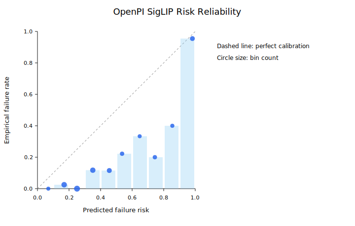
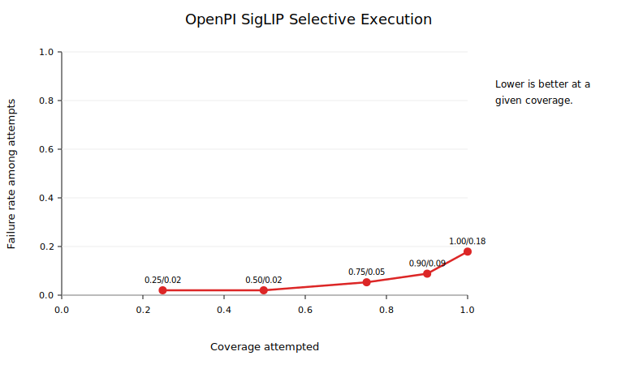

# OpenPI/LIBERO Risk Training

Status: `PASS`

This report is the current robot-foundation-policy checkpoint for the project. OpenPI `pi05_libero` is used as the vision-language-action policy, LIBERO supplies the manipulation tasks, and this layer learns rollout-level failure-risk models for selective execution and adaptive action chunking.

## Dataset

The risk dataset is built from direct OpenPI/LIBERO rollouts. Each row is one episode converted into initial/task/stressor features plus early rollout progress statistics; labels mark any terminal failure or timeout.

```json
{
  "all": {
    "examples": 993,
    "failure_rate": 0.17522658610271905,
    "failures": 174,
    "timeout_rate": 0.17522658610271905,
    "timeouts": 174
  },
  "calibration": {
    "examples": 197,
    "failure_rate": 0.17258883248730963,
    "failures": 34,
    "timeout_rate": 0.17258883248730963,
    "timeouts": 34
  },
  "test": {
    "examples": 201,
    "failure_rate": 0.1791044776119403,
    "failures": 36,
    "timeout_rate": 0.1791044776119403,
    "timeouts": 36
  },
  "train": {
    "examples": 595,
    "failure_rate": 0.17478991596638654,
    "failures": 104,
    "timeout_rate": 0.17478991596638654,
    "timeouts": 104
  }
}
```

Dataset coverage:

```json
{
  "by_stressor": {
    "action_noise": 216,
    "none": 412,
    "occlusion": 365
  },
  "by_stressor_severity": {
    "action_noise:0.20": 70,
    "action_noise:0.40": 70,
    "action_noise:0.60": 70,
    "action_noise:0.70": 6,
    "none:0.00": 412,
    "occlusion:0.20": 70,
    "occlusion:0.40": 70,
    "occlusion:0.60": 70,
    "occlusion:0.70": 6,
    "occlusion:0.80": 70,
    "occlusion:1.00": 79
  },
  "by_suite": {
    "libero_10": 101,
    "libero_goal": 101,
    "libero_object": 101,
    "libero_spatial": 690
  },
  "by_suite_stressor": {
    "libero_10": {
      "none": 101
    },
    "libero_goal": {
      "none": 101
    },
    "libero_object": {
      "none": 101
    },
    "libero_spatial": {
      "action_noise": 216,
      "none": 109,
      "occlusion": 365
    }
  },
  "by_task": {
    "libero_10:task00": 11,
    "libero_10:task01": 10,
    "libero_10:task02": 10,
    "libero_10:task03": 10,
    "libero_10:task04": 10,
    "libero_10:task05": 10,
    "libero_10:task06": 10,
    "libero_10:task07": 10,
    "libero_10:task08": 10,
    "libero_10:task09": 10,
    "libero_goal:task00": 11,
    "libero_goal:task01": 10,
    "libero_goal:task02": 10,
    "libero_goal:task03": 10,
    "libero_goal:task04": 10,
    "libero_goal:task05": 10,
    "libero_goal:task06": 10,
    "libero_goal:task07": 10,
    "libero_goal:task08": 10,
    "libero_goal:task09": 10,
    "libero_object:task00": 11,
    "libero_object:task01": 10,
    "libero_object:task02": 10,
    "libero_object:task03": 10,
    "libero_object:task04": 10,
    "libero_object:task05": 10,
    "libero_object:task06": 10,
    "libero_object:task07": 10,
    "libero_object:task08": 10,
    "libero_object:task09": 10,
    "libero_spatial:task00": 76,
    "libero_spatial:task01": 76,
    "libero_spatial:task02": 76,
    "libero_spatial:task03": 66,
    "libero_spatial:task04": 66,
    "libero_spatial:task05": 66,
    "libero_spatial:task06": 66,
    "libero_spatial:task07": 66,
    "libero_spatial:task08": 66,
    "libero_spatial:task09": 66
  },
  "episodes": 993,
  "failures": 174,
  "gpu_models": {
    "NVIDIA RTX A4500": 993
  },
  "run_ids": 19,
  "successes": 819
}
```

## Calibration

Temperature scaling selected `T=1.5` and planner threshold `0.5905054457889825` on the calibration split.

```json
{
  "method": "temperature_scaling_grid",
  "temperature": 1.5,
  "threshold": 0.5905054457889825
}
```

## Test Metrics

| Model | AUROC | AUPRC | Brier | NLL | ECE | Coverage @ threshold | Failure rate attempted |
| --- | ---: | ---: | ---: | ---: | ---: | ---: | ---: |
| global prior | 0.500 | 0.179 | 0.147 | 0.470 | 0.004 | 1.000 | 0.179 |
| fixed task prior | 0.695 | 0.347 | 0.139 | 0.690 | 0.062 | 1.000 | 0.179 |
| structured_progress_risk | 0.702 | 0.297 | 0.238 | 0.668 | 0.315 | 1.000 | 0.179 |

Model ablations:

| Variant | Status | Stressor metadata | Test AUROC | Test AUPRC | Test ECE | Coverage @ threshold | Note |
| --- | --- | ---: | ---: | ---: | ---: | ---: | --- |
| `metadata_oracle_risk` | trained | True | 0.930 | 0.840 | 0.264 | 0.821 | Diagnostic upper-bound model that is allowed to see controlled stressor metadata. It should not be treated as deployable risk perception. |
| `structured_progress_risk` | trained | False | 0.702 | 0.297 | 0.315 | 1.000 | Deployable structured baseline using task/language hashes, action horizon, and early rollout progress statistics, with hidden stressor metadata removed. |
| `vision_language_risk` | trained | False | 0.905 | 0.811 | 0.235 | 0.861 | Deployable frozen SigLIP first-frame image-embedding ablation. It combines observable structured/progress features with compact VLM image features extracted from rollout videos, and it does not use hidden stressor metadata. |

Offline policy comparison at matched coverage:

| Policy | Status | Coverage | Task completion | Failure attempted | Timeout | Abstain | Utility | Query overhead | Note |
| --- | --- | ---: | ---: | ---: | ---: | ---: | ---: | ---: | --- |
| `direct_openpi` | evaluated | 1.000 | 0.821 | 0.179 | 0.179 | 0.000 | 0.716 | 1.000 | Observed direct OpenPI test episodes. |
| `global_prior_selective` | evaluated | 0.900 | 0.736 | 0.182 | 0.164 | 0.100 | 0.621 | 0.899 | Offline selective execution using the global training failure prior. |
| `fixed_task_prior_selective` | evaluated | 0.900 | 0.771 | 0.144 | 0.129 | 0.100 | 0.673 | 0.883 | Offline selective execution using per-suite/task training priors. |
| `metadata_oracle_risk_selective` | evaluated | 0.900 | 0.821 | 0.088 | 0.080 | 0.100 | 0.748 | 0.856 | Offline selective execution using `metadata_oracle_risk` risk scores. |
| `structured_progress_risk_selective` | evaluated | 0.900 | 0.756 | 0.160 | 0.144 | 0.100 | 0.651 | 0.898 | Offline selective execution using `structured_progress_risk` risk scores. |
| `adaptive_chunk_openpi_offline` | offline_counterfactual | 1.000 | 0.821 | 0.179 | 0.179 | 0.000 | 0.716 | 0.997 | Risk changes estimated action horizon and policy-query overhead only; success labels are not resimulated. |
| `early_abort_on_no_progress_offline` | offline_counterfactual | 0.970 | 0.796 | 0.179 | 0.174 | 0.030 | 0.689 | 0.944 | Aborts episodes whose first logged prefix has high no-progress; not a resimulated controller result. |
| `adaptive_chunk_plus_abort_offline` | offline_counterfactual | 0.970 | 0.796 | 0.179 | 0.174 | 0.030 | 0.689 | 0.941 | Combines adaptive horizon overhead estimate with the same prefix no-progress abort rule. |
| `vision_language_risk_selective` | evaluated | 0.900 | 0.821 | 0.088 | 0.080 | 0.100 | 0.748 | 0.856 | Offline selective execution using frozen SigLIP image-embedding risk scores. |

Bootstrap confidence intervals for selected supervisor metrics are stored in the risk summary. Compact view:

| Policy | Success CI | Failure CI | Timeout CI | Abstain CI | Utility CI |
| --- | ---: | ---: | ---: | ---: | ---: |
| `direct_openpi` | 0.820 [0.766, 0.871] | 0.180 [0.129, 0.234] | 0.180 [0.129, 0.234] | 0.000 [0.000, 0.000] | 0.715 [0.634, 0.792] |
| `fixed_task_prior_selective` | 0.771 [0.711, 0.831] | 0.130 [0.085, 0.179] | 0.130 [0.085, 0.179] | 0.099 [0.060, 0.144] | 0.672 [0.590, 0.753] |
| `structured_progress_risk_selective` | 0.755 [0.687, 0.816] | 0.145 [0.100, 0.199] | 0.145 [0.100, 0.199] | 0.100 [0.060, 0.139] | 0.649 [0.561, 0.731] |
| `metadata_oracle_risk_selective` | 0.820 [0.766, 0.871] | 0.079 [0.045, 0.119] | 0.079 [0.045, 0.119] | 0.101 [0.060, 0.144] | 0.747 [0.674, 0.816] |
| `vision_language_risk_selective` | 0.820 [0.766, 0.871] | 0.079 [0.045, 0.119] | 0.079 [0.045, 0.119] | 0.101 [0.060, 0.144] | 0.747 [0.675, 0.816] |
| `adaptive_chunk_openpi_offline` | 0.820 [0.766, 0.871] | 0.180 [0.129, 0.234] | 0.180 [0.129, 0.234] | 0.000 [0.000, 0.000] | 0.715 [0.634, 0.792] |
| `early_abort_on_no_progress_offline` | 0.795 [0.736, 0.851] | 0.175 [0.124, 0.229] | 0.175 [0.124, 0.229] | 0.030 [0.010, 0.055] | 0.687 [0.599, 0.768] |
| `adaptive_chunk_plus_abort_offline` | 0.795 [0.736, 0.851] | 0.175 [0.124, 0.229] | 0.175 [0.124, 0.229] | 0.030 [0.010, 0.055] | 0.687 [0.599, 0.768] |


The metadata-aware model is diagnostic because it can observe the injected stressor. The structured/progress model is the primary deployable baseline in this report because it excludes hidden stressor metadata.

VLM ablation: `vision_language_risk` is trained from frozen SigLIP first-frame embeddings extracted from the logged rollout videos, combined with the same observable structured/progress features. Test AUROC is 0.905, AUPRC is 0.811, and ECE is 0.235. The result is reported as an observed-image ablation, not as a finetuned VLM or a learned world model.





## Runtime SigLIP Supervisor Evaluation

The offline SigLIP result has now been moved into the real OpenPI/LIBERO execution loop. In `vision_language_risk_selective` mode the evaluator captures the post-stressor initial RGB frame, computes a frozen SigLIP embedding at runtime, waits for a 10-step observable progress prefix, predicts calibrated failure risk, and either executes OpenPI or abstains before committing to the rest of the episode.

Runtime validation used held-out SLURM jobs `10133` through `10147` on `libero_spatial` tasks `0..9`, seed `2000`, and three trials per task/condition. The stress grid was `none:0.0`, `occlusion:0.4`, `occlusion:0.6`, `occlusion:0.8`, `occlusion:1.0`, `action_noise:0.4`, and `action_noise:0.6`. Each mode has `210` real robot-policy episodes, for `630` runtime episodes total, all on `NVIDIA RTX A4500`.

| Runtime mode | Episodes | Coverage | Completion | Attempted completion | Failure attempted | Timeout | Abstain | Utility | Query overhead |
| --- | ---: | ---: | ---: | ---: | ---: | ---: | ---: | ---: | ---: |
| `direct_openpi` | 210 | 1.000 | 0.695 | 0.695 | 0.305 | 0.305 | 0.000 | 0.528 | 1.000 |
| `fixed_task_prior_selective` | 210 | 1.000 | 0.686 | 0.686 | 0.314 | 0.314 | 0.000 | 0.514 | 1.016 |
| `vision_language_risk_selective` | 210 | 0.681 | 0.595 | 0.874 | 0.126 | 0.086 | 0.319 | 0.480 | 0.597 |

Bootstrap confidence intervals:

| Runtime mode | Completion CI | Failure CI | Timeout CI | Abstain CI | Utility CI |
| --- | ---: | ---: | ---: | ---: | ---: |
| `direct_openpi` | 0.695 [0.638, 0.762] | 0.305 [0.238, 0.362] | 0.305 [0.238, 0.362] | 0.000 [0.000, 0.000] | 0.528 [0.442, 0.629] |
| `fixed_task_prior_selective` | 0.686 [0.619, 0.748] | 0.314 [0.252, 0.376] | 0.314 [0.252, 0.376] | 0.000 [0.000, 0.000] | 0.514 [0.413, 0.607] |
| `vision_language_risk_selective` | 0.595 [0.533, 0.671] | 0.086 [0.048, 0.129] | 0.086 [0.048, 0.129] | 0.319 [0.252, 0.381] | 0.480 [0.399, 0.572] |

Interpretation: the runtime SigLIP supervisor meaningfully reduces failures among attempted episodes (`0.126` vs `0.305` for direct OpenPI and `0.314` for fixed priors), and it cuts policy-query load by abstaining from severe occlusion settings. The offline result only partially holds online: the calibration threshold is too conservative under the held-out runtime stress distribution, so completion and utility are lower than direct OpenPI because `31.9%` of episodes are rejected. This is a useful risk signal, not yet the final supervisor operating point.

One caveat on overhead: `mean_runtime_risk_compute_seconds` is the per-episode prediction call after the SigLIP model is loaded. It does not include one-time model load or dependency setup time inside the SLURM job.

### Runtime Threshold Sweep

The next experiment tunes the operating point without changing the model or architecture. Thresholds are selected only on a task-disjoint runtime calibration split: tasks `0..4` are calibration and tasks `5..9` are test. The split uses the same seven stress conditions per task. Each threshold is chosen from calibration risk scores to target a desired calibration coverage, then evaluated once on the held-out test tasks.

This sweep uses paired real runtime data: runtime SigLIP provides the risk score for each condition, and the paired `direct_openpi` episode provides the outcome if that condition is attempted. If a threshold rejects an episode, the evaluator uses the observed 10-step runtime prefix cost as the abstention proxy. It is therefore a paired runtime threshold sweep, not a separate resimulation for every threshold.

Direct OpenPI on the test split has utility `0.571` and attempted failure `0.276`.

| Calibration target | Threshold | Test coverage | Completion | Attempted completion | Attempted failure | Failure reduction | Abstain | Utility | Utility delta |
| ---: | ---: | ---: | ---: | ---: | ---: | ---: | ---: | ---: | ---: |
| 0.70 | 0.807366 | 0.686 | 0.629 | 0.917 | 0.083 | 0.193 | 0.314 | 0.528 | -0.043 |
| 0.75 | 0.933328 | 0.781 | 0.714 | 0.915 | 0.085 | 0.191 | 0.219 | 0.627 | 0.056 |
| 0.80 | 0.957162 | 0.810 | 0.714 | 0.882 | 0.118 | 0.159 | 0.190 | 0.618 | 0.047 |
| 0.85 | 0.986033 | 0.857 | 0.724 | 0.844 | 0.156 | 0.121 | 0.143 | 0.617 | 0.046 |
| 0.90 | 0.995939 | 0.933 | 0.724 | 0.776 | 0.224 | 0.052 | 0.067 | 0.592 | 0.021 |
| 0.95 | 0.997775 | 0.962 | 0.724 | 0.752 | 0.248 | 0.029 | 0.038 | 0.583 | 0.012 |
| 1.00 | 0.999146 | 1.000 | 0.724 | 0.724 | 0.276 | 0.000 | 0.000 | 0.571 | 0.000 |

Best utility operating point: target `0.75`, test coverage `0.781`, utility `0.627`, and attempted failure `0.085`. This beats direct OpenPI test utility by `0.056` while reducing attempted failure by `0.191`.

Best safety operating point: target `0.70`, test attempted failure `0.083`, at test coverage `0.686`. If coverage must be at least `0.85`, the best row is target `0.85`, with test coverage `0.857` and attempted failure `0.156`. At at least `0.90` coverage, the best row is target `0.90`, with attempted failure `0.224`. At at least `0.95` coverage, the best row is target `0.95`, with attempted failure `0.248`.

Bootstrap confidence intervals for every threshold row are stored in `reports/openpi_runtime_siglip_eval_summary.json`. For the best-utility row, utility CI is `[0.513, 0.746]` and attempted-failure CI is `[0.025, 0.148]`.

### Tuned Threshold Deployment

The best-utility threshold from the sweep was deployed in a fresh real SLURM run, job `10148`, using seed `3000` on `libero_spatial` tasks `5..9`, stressors `occlusion` and `action_noise`, severity `0.6`, and `3` trials per task/stressor. This is the exact launch command:

```bash
RUNTIME_RISK_THRESHOLD_OVERRIDE=0.9333276460818999 MODE=vision_language_risk_selective RISK_SUMMARY=reports/openpi_libero_risk_summary.json SUITES="libero_spatial" TASK_IDS="5 6 7 8 9" NUM_TRIALS=3 STRESSORS="occlusion action_noise" STRESSOR_SEVERITY=0.6 SEED=3000 OPENPI_INSTALL_VISION_DEPS=1 sbatch slurm/openpi_libero_rollouts.sbatch
```

| Run | Episodes | Coverage | Completion | Attempted failure | Timeout | Abstain | Utility | Mean policy queries |
| --- | ---: | ---: | ---: | ---: | ---: | ---: | ---: | ---: |
| tuned SigLIP threshold, job `10148` | 30 | 1.000 | 0.933 | 0.067 | 0.067 | 0.000 | 0.888 | 25.433 |

By stressor:

| Stressor | Episodes | Successes | Timeouts | Abstentions |
| --- | ---: | ---: | ---: | ---: |
| `occlusion:0.60` | 15 | 14 | 1 | 0 |
| `action_noise:0.60` | 15 | 14 | 1 | 0 |

This deployment run confirms that the tuned threshold does not over-abstain on moderate held-out stress: all `30` episodes were attempted. The result is positive, but it is not a controlled same-seed direct-vs-tuned comparison; the appropriate controlled comparison remains the task-disjoint paired threshold sweep above. The next controlled deployment should run direct OpenPI and tuned SigLIP on the same new seed and include higher occlusion settings where abstention should occur.

### Same-Seed Controlled Deployment

The next deployment uses a controlled same-seed grid so that direct OpenPI, fixed task priors, and both tuned runtime SigLIP thresholds see the same task IDs, stress conditions, trial count, and seed. Jobs `10149..10168` run `libero_spatial` tasks `5..9`, seed `4000`, `5` trials per condition, and the conditions `none`, `occlusion:0.60`, `occlusion:0.80`, `occlusion:1.00`, and `action_noise:0.60`.

The summary is generated by:

```bash
PYTHONPATH=src python scripts/summarize_openpi_controlled_deployment.py \
  --manifest reports/openpi_controlled_deployment_jobs_seed4000.jsonl \
  --output reports/openpi_runtime_controlled_deployment_summary.json
```

| Runtime mode | Jobs | Episodes | Coverage | Completion | Attempted completion | Attempted failure | Timeout | Abstain | Utility | Mean policy queries |
| --- | --- | ---: | ---: | ---: | ---: | ---: | ---: | ---: | ---: | ---: |
| `direct_openpi` | `10149..10153` | 125 | 1.000 | 0.656 | 0.656 | 0.344 | 0.344 | 0.000 | 0.469 | 31.040 |
| `fixed_task_prior_selective` | `10154..10158` | 125 | 1.000 | 0.648 | 0.648 | 0.352 | 0.352 | 0.000 | 0.457 | 30.760 |
| `vision_language_risk_selective`, threshold `0.9333276460818999` | `10159..10163` | 125 | 0.680 | 0.584 | 0.859 | 0.141 | 0.096 | 0.320 | 0.463 | 18.336 |
| `vision_language_risk_selective`, threshold `0.9860334584902223` | `10164..10168` | 125 | 0.800 | 0.616 | 0.770 | 0.230 | 0.184 | 0.200 | 0.473 | 22.928 |

Comparison against direct OpenPI:

| Runtime mode | Utility delta | Attempted-failure delta | Completion delta | Coverage delta |
| --- | ---: | ---: | ---: | ---: |
| `fixed_task_prior_selective` | -0.012 | 0.008 | -0.008 | 0.000 |
| SigLIP threshold `0.9333276460818999` | -0.006 | -0.203 | -0.072 | -0.320 |
| SigLIP threshold `0.9860334584902223` | 0.004 | -0.114 | -0.040 | -0.200 |

Matched-coverage abstention baselines:

| Supervisor | Coverage | Utility | Attempted failure | Random-abstain utility | Random-abstain attempted failure | Oracle-abstain utility | Oracle-abstain attempted failure |
| --- | ---: | ---: | ---: | ---: | ---: | ---: | ---: |
| SigLIP threshold `0.9333276460818999` | 0.680 | 0.463 | 0.141 | 0.254 | 0.344 | 0.571 | 0.035 |
| SigLIP threshold `0.9860334584902223` | 0.800 | 0.473 | 0.230 | 0.335 | 0.344 | 0.533 | 0.180 |

By-condition behavior:

| Runtime mode | Condition | Coverage | Completion | Attempted failure | Abstain |
| --- | --- | ---: | ---: | ---: | ---: |
| SigLIP threshold `0.9333276460818999` | `none:0.00` | 1.000 | 1.000 | 0.000 | 0.000 |
| SigLIP threshold `0.9333276460818999` | `occlusion:0.60` | 1.000 | 0.760 | 0.240 | 0.000 |
| SigLIP threshold `0.9333276460818999` | `occlusion:0.80` | 0.400 | 0.200 | 0.500 | 0.600 |
| SigLIP threshold `0.9333276460818999` | `occlusion:1.00` | 0.000 | 0.000 | 0.000 | 1.000 |
| SigLIP threshold `0.9333276460818999` | `action_noise:0.60` | 1.000 | 0.960 | 0.040 | 0.000 |
| SigLIP threshold `0.9860334584902223` | `none:0.00` | 1.000 | 1.000 | 0.000 | 0.000 |
| SigLIP threshold `0.9860334584902223` | `occlusion:0.60` | 1.000 | 0.800 | 0.200 | 0.000 |
| SigLIP threshold `0.9860334584902223` | `occlusion:0.80` | 0.960 | 0.280 | 0.708 | 0.040 |
| SigLIP threshold `0.9860334584902223` | `occlusion:1.00` | 0.040 | 0.000 | 1.000 | 0.960 |
| SigLIP threshold `0.9860334584902223` | `action_noise:0.60` | 1.000 | 1.000 | 0.000 | 0.000 |

Interpretation: the controlled run is the strongest runtime evidence in the repository so far. The higher-coverage SigLIP threshold `0.9860334584902223` is the best deployable tradeoff in this grid because it slightly beats direct OpenPI utility while reducing attempted failure by `0.114` absolute. The lower threshold `0.9333276460818999` is more conservative, reducing attempted failure by `0.203` absolute at the cost of lower coverage and slightly lower utility. Both thresholds beat random abstention at matched coverage, which indicates the VLM risk score is selecting meaningfully harder episodes rather than merely reducing the number of attempts.

The remaining honest limitation is statistical and environmental scope: this is `libero_spatial` simulation on held-out task IDs and stressors, not a real-robot or formal safety result. The right resume-level claim is runtime risk-aware supervision for OpenPI/LIBERO under distribution shift, with a tunable coverage/reliability frontier.

## Offline Supervisor

```json
{
  "coverage_curve": [
    {
      "attempted_success_rate": 0.96,
      "coverage": 0.24875621890547264,
      "failure_rate_attempted": 0.04,
      "rejection_rate": 0.7512437810945274,
      "target_coverage": 0.25,
      "task_completion_rate": 0.23880597014925373,
      "threshold": 0.44768666155417197
    },
    {
      "attempted_success_rate": 0.89,
      "coverage": 0.4975124378109453,
      "failure_rate_attempted": 0.11,
      "rejection_rate": 0.5024875621890548,
      "target_coverage": 0.5,
      "task_completion_rate": 0.4427860696517413,
      "threshold": 0.5172652308942609
    },
    {
      "attempted_success_rate": 0.8609271523178808,
      "coverage": 0.7512437810945274,
      "failure_rate_attempted": 0.1390728476821192,
      "rejection_rate": 0.24875621890547261,
      "target_coverage": 0.75,
      "task_completion_rate": 0.6467661691542289,
      "threshold": 0.5455260262530917
    },
    {
      "attempted_success_rate": 0.8397790055248618,
      "coverage": 0.900497512437811,
      "failure_rate_attempted": 0.16022099447513813,
      "rejection_rate": 0.09950248756218905,
      "target_coverage": 0.9,
      "task_completion_rate": 0.7562189054726368,
      "threshold": 0.5574119437069767
    },
    {
      "attempted_success_rate": 0.8208955223880597,
      "coverage": 1.0,
      "failure_rate_attempted": 0.1791044776119403,
      "rejection_rate": 0.0,
      "target_coverage": 1.0,
      "task_completion_rate": 0.8208955223880597,
      "threshold": 0.5887513486452586
    }
  ],
  "interpretation": "Episodes with calibrated p_failure >= threshold are abstained in this offline coverage analysis.",
  "mode": "selective_openpi",
  "test_coverage": 1.0,
  "test_failure_rate_attempted": 0.1791044776119403,
  "threshold": 0.5905054457889825,
  "threshold_source": "calibration_split"
}
```

## Reproduce

```bash
SUITES="libero_spatial libero_object libero_goal libero_10" TASK_IDS="0 1 2 3 4 5 6 7 8 9" NUM_TRIALS=10 STRESSORS="none" sbatch slurm/openpi_libero_rollouts.sbatch
SUITES="libero_spatial" TASK_IDS="0 1 2 3 4 5 6 7 8 9" NUM_TRIALS=7 STRESSORS="occlusion action_noise" STRESSOR_SEVERITY=0.6 sbatch slurm/openpi_libero_rollouts.sbatch
PYTHONPATH=src python scripts/extract_openpi_siglip_embeddings.py --config configs/openpi/train_risk.yaml --output outputs/openpi_libero/siglip_episode_embeddings.jsonl --dims 64
PYTHONPATH=src python scripts/train_openpi_risk.py --config configs/openpi/train_risk.yaml
MODE=adaptive_chunk_openpi RISK_SUMMARY=reports/openpi_libero_risk_summary.json SUITES="libero_spatial" TASK_IDS="0 1 2" NUM_TRIALS=2 STRESSORS="occlusion" STRESSOR_SEVERITY=1.0 sbatch slurm/openpi_libero_rollouts.sbatch
```

Runtime SigLIP supervisor validation:

```bash
for MODE in direct_openpi fixed_task_prior_selective vision_language_risk_selective; do
  MODE="$MODE" RISK_SUMMARY=reports/openpi_libero_risk_summary.json SUITES="libero_spatial" TASK_IDS="0 1 2 3 4 5 6 7 8 9" NUM_TRIALS=3 STRESSORS="none" STRESSOR_SEVERITY=0.0 SEED=2000 OPENPI_INSTALL_VISION_DEPS=1 sbatch slurm/openpi_libero_rollouts.sbatch
  MODE="$MODE" RISK_SUMMARY=reports/openpi_libero_risk_summary.json SUITES="libero_spatial" TASK_IDS="0 1 2 3 4 5 6 7 8 9" NUM_TRIALS=3 STRESSORS="occlusion action_noise" STRESSOR_SEVERITY=0.4 SEED=2000 OPENPI_INSTALL_VISION_DEPS=1 sbatch slurm/openpi_libero_rollouts.sbatch
  MODE="$MODE" RISK_SUMMARY=reports/openpi_libero_risk_summary.json SUITES="libero_spatial" TASK_IDS="0 1 2 3 4 5 6 7 8 9" NUM_TRIALS=3 STRESSORS="occlusion action_noise" STRESSOR_SEVERITY=0.6 SEED=2000 OPENPI_INSTALL_VISION_DEPS=1 sbatch slurm/openpi_libero_rollouts.sbatch
  MODE="$MODE" RISK_SUMMARY=reports/openpi_libero_risk_summary.json SUITES="libero_spatial" TASK_IDS="0 1 2 3 4 5 6 7 8 9" NUM_TRIALS=3 STRESSORS="occlusion" STRESSOR_SEVERITY=0.8 SEED=2000 OPENPI_INSTALL_VISION_DEPS=1 sbatch slurm/openpi_libero_rollouts.sbatch
  MODE="$MODE" RISK_SUMMARY=reports/openpi_libero_risk_summary.json SUITES="libero_spatial" TASK_IDS="0 1 2 3 4 5 6 7 8 9" NUM_TRIALS=3 STRESSORS="occlusion" STRESSOR_SEVERITY=1.0 SEED=2000 OPENPI_INSTALL_VISION_DEPS=1 sbatch slurm/openpi_libero_rollouts.sbatch
done

PYTHONPATH=src python scripts/summarize_openpi_runtime_eval.py \
  --input 'datasets/openpi_libero_rollouts/openpi_rollouts_1013[3-9].jsonl' \
  --input 'datasets/openpi_libero_rollouts/openpi_rollouts_1014[0-7].jsonl' \
  --output reports/openpi_runtime_siglip_eval_summary.json

PYTHONPATH=src python scripts/sweep_openpi_runtime_thresholds.py \
  --input 'datasets/openpi_libero_rollouts/openpi_rollouts_1013[3-9].jsonl' \
  --input 'datasets/openpi_libero_rollouts/openpi_rollouts_1014[0-7].jsonl' \
  --output reports/openpi_runtime_siglip_eval_summary.json

RUNTIME_RISK_THRESHOLD_OVERRIDE=0.9333276460818999 MODE=vision_language_risk_selective RISK_SUMMARY=reports/openpi_libero_risk_summary.json SUITES="libero_spatial" TASK_IDS="5 6 7 8 9" NUM_TRIALS=3 STRESSORS="occlusion action_noise" STRESSOR_SEVERITY=0.6 SEED=3000 OPENPI_INSTALL_VISION_DEPS=1 sbatch slurm/openpi_libero_rollouts.sbatch
```

## Limitations

- This is an OpenPI/LIBERO execution-risk study, not a formal safety guarantee.
- The deployable structured model excludes injected stressor metadata; the metadata-aware model is reported only as a diagnostic upper bound.
- The VLM result uses frozen first-frame SigLIP embeddings from rollout videos; it is an observed-image ablation, not a finetuned VLM or learned dynamics model.
- Runtime SigLIP supervision improves attempted-failure rate by rejecting high-risk episodes. The original offline threshold is too conservative online, but the task-disjoint runtime threshold sweep finds utility-positive operating points in the paired runtime analysis.

<!-- OPENPI_METRICS_AUDIT_START -->
## Metrics Audit

Status: `PASS`
Audit JSON: `reports/openpi_metrics_audit.json`

```json
{
  "calibration_threshold_recomputed": 0.5905054457889825,
  "failures": [],
  "global_prior_test_auprc": 0.1791044776119403,
  "global_prior_test_positive_rate": 0.1791044776119403,
  "leakage_checks": {
    "allowed_frame_sources": [
      "early_prefix_frame",
      "runtime_initial_frame",
      "video_first_frame"
    ],
    "embedding_path": "outputs/openpi_libero/siglip_episode_embeddings.jsonl",
    "embedding_rows": 993,
    "frame_sources": {
      "video_first_frame": 993
    },
    "invalid_frame_source_count": 0,
    "status": "checked",
    "stressor_feature_overlap": [],
    "threshold_source": "calibration split; recomputed in variant metric audit",
    "uses_stressor_metadata": false
  },
  "ok": true,
  "raw_episode_counts": {
    "abstained": 141,
    "by_mode": {
      "adaptive_chunk_openpi": 6,
      "direct_openpi": 1328,
      "fixed_task_prior_selective": 335,
      "selective_openpi": 9,
      "vision_language_risk_selective": 491
    },
    "by_stressor": {
      "action_noise": 511,
      "none": 603,
      "occlusion": 1055
    },
    "by_stressor_severity": {
      "action_noise:0.20": 70,
      "action_noise:0.40": 160,
      "action_noise:0.60": 275,
      "action_noise:0.70": 6,
      "none:0.00": 603,
      "occlusion:0.20": 70,
      "occlusion:0.40": 160,
      "occlusion:0.60": 275,
      "occlusion:0.70": 6,
      "occlusion:0.80": 260,
      "occlusion:1.00": 284
    },
    "by_suite": {
      "libero_10": 101,
      "libero_goal": 101,
      "libero_object": 101,
      "libero_spatial": 1866
    },
    "episodes": 2169,
    "successes": 1576,
    "timeouts": 452
  },
  "split_sizes": {
    "calibration": 197,
    "test": 201,
    "train": 595
  },
  "summary_threshold": 0.5905054457889825
}
```
<!-- OPENPI_METRICS_AUDIT_END -->
